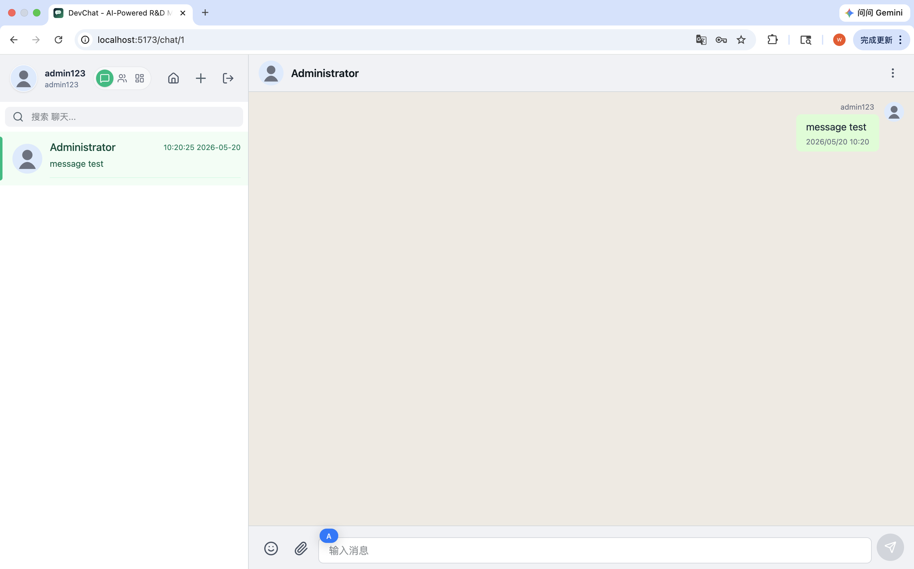
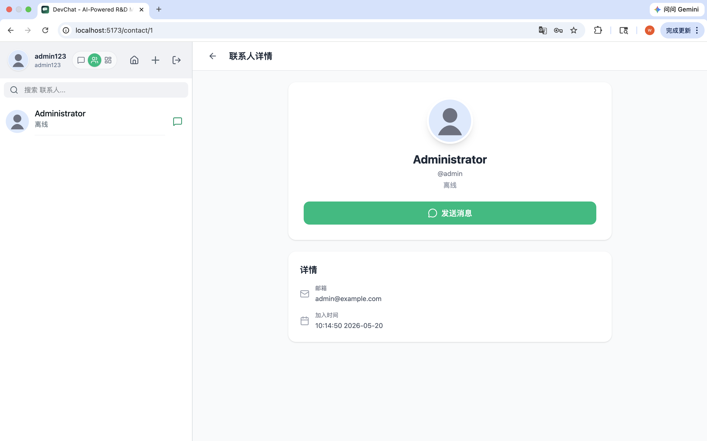
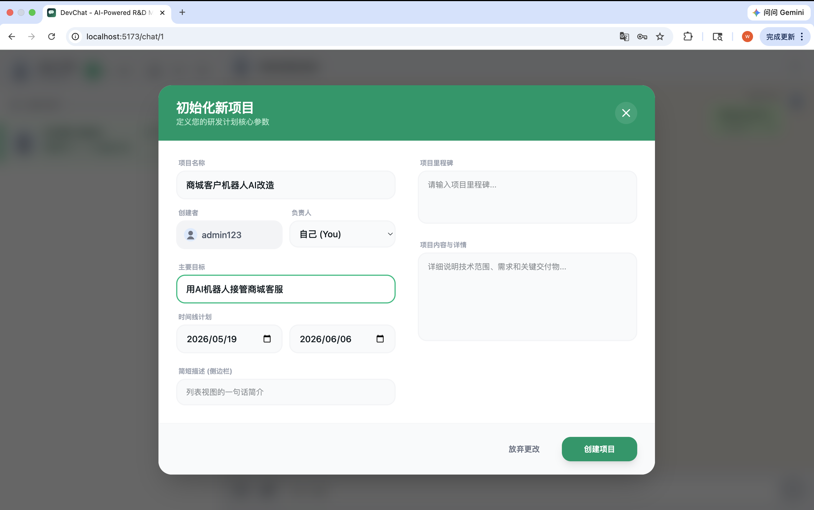
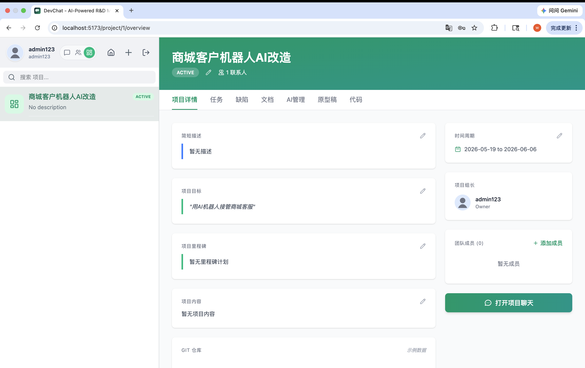
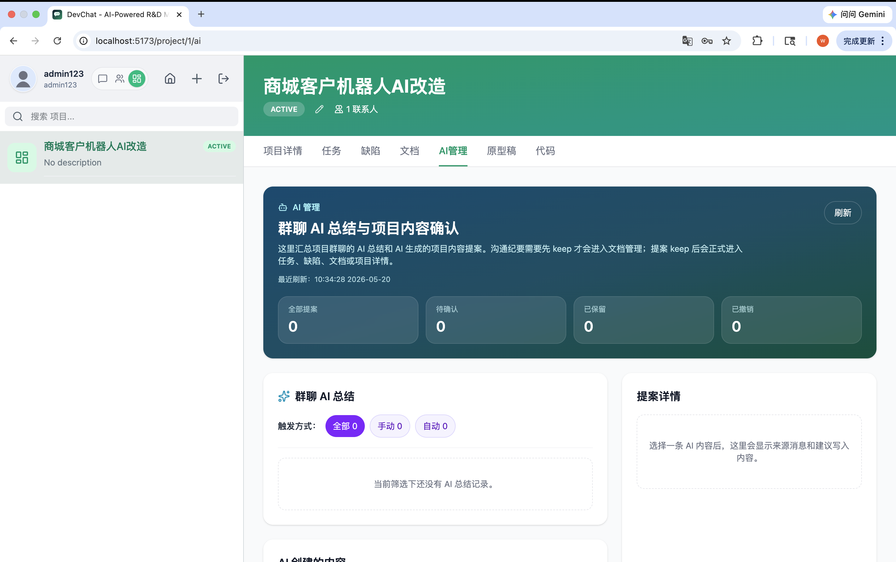

# DevChat 

## 1. 产品定位

DevChat 是一个把聊天、项目协作和 AI 管理合并到同一界面的研发协作工具。

当前主线不是“纯聊天工具”，而是以下闭环：

- 成员在私聊、群聊、项目群聊中沟通
- 项目群聊中的项目讨论可被 AI 总结
- AI 先生成“沟通纪要草稿”和“待确认提案”
- 项目负责人或项目成员在项目详情中查看总结
- 项目负责人确认后，提案正式进入任务、缺陷、文档或项目概览

效果图 

项目分前端和后端两个部分，app-web，server-web。